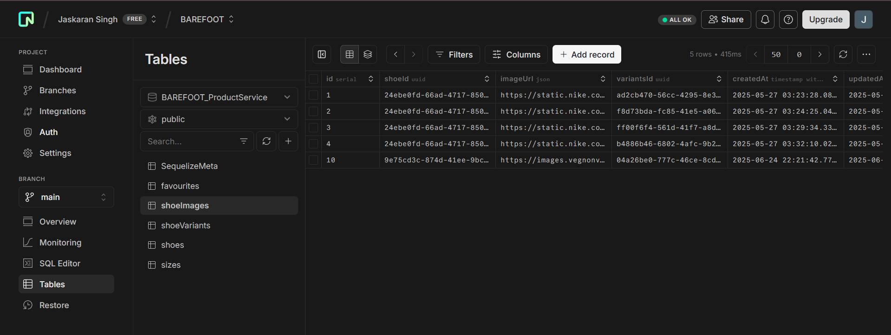
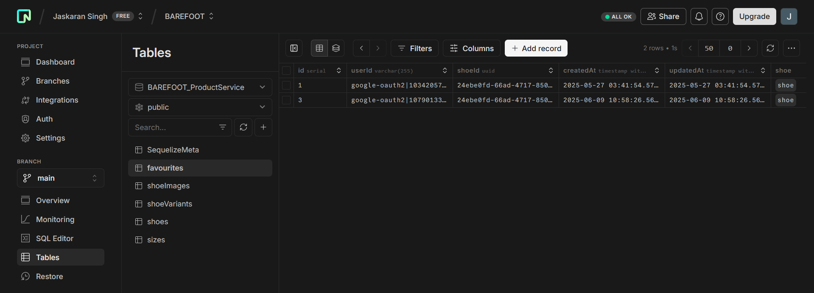
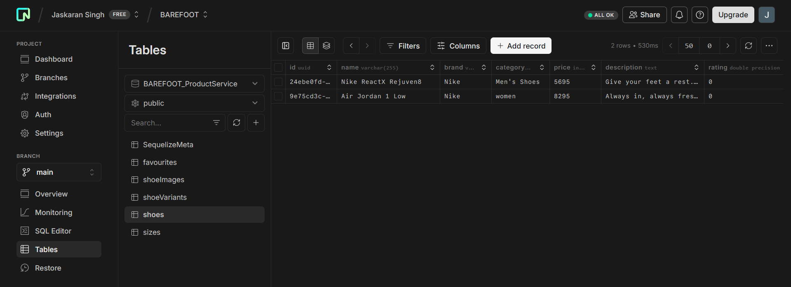
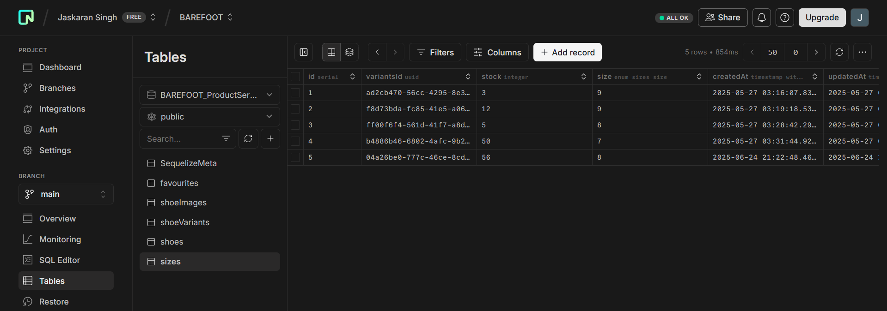
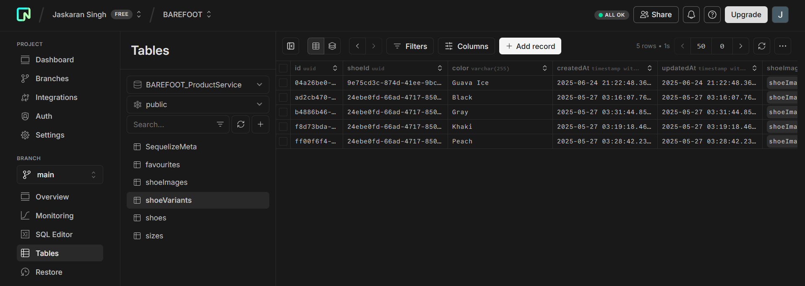

## Week 6 Assignment (Celebal Technologies) Submitted by singh.jaskaran2024@gmail.com

### Create a RESTful API using Node.js and Express that supports basic CRUD operations on a resource (like users, products, etc.)

Backend for a Shoe Selling Application
Authentication: Using Clerk
DB: postgresql
ORM: Sequelize
Used Redis for caching the products for /get route
Implemented Role based Access Control using Auth0

Schema: favourites, shoeImages, shoes, shoeVariants, sizes

Steps:

1. Clone the repo
2. npm i
3. Get credentials from your auth0 dashboard
4. Get DB url
5. Set up your .env file
   ```
       PORT = 3000
       REDIS_HOST = "From redis insight"
       REDIS_PASS = "From redis insight"
       REDIS_PORT = "From redis insight"
       DATABASE_URL = "DB URL"
       ISSUER = "FROM AUTH00
       AUDIENCE = "FROM AUTH00"
       JWKSURI = "FROM AUTH0"
   ```

Screenshots:

### Schema : ShoeImages



### Schema : Favourites



### Schema : Shoe



### Schema : Shoe Sizes



### Schema : Shoe Variants



Routes implemented:
User Routes

```
api/user/get-all-products
api/user/get-by-Id/:id
api/user/get-by-variantId/:id
api/user/addToFavourites/:shoeId
api/user/getFavourites
api/user/checkFavourite/:id
api/user/removeFavourite/:productId
```

Admin Routes

```
api/v1/addProduct
api/v1/addColor
api/v1/removeColor
api/v1/removeProduct
api/v1/addSize
api/v1/removeSize
api/v1/uploadImage
api/v1/get-variants-by-shoeId/:shoeId
```
